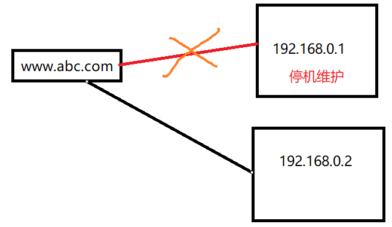

# DNS

### 一、DNS概述 <a href="#vbhyx" id="vbhyx"></a>

**DNS**（Domain Name System，**域名系统**），因特网上作为**域名和IP地址互相映射**的一个**分布式数据库**，能够使用户更方便的访问互联网，而不用去记住能够被机器直接读取的IP数串。

通过主机名，最终得到该主机对应的IP地址的过程叫做**域名解析**（或主机名解析）。

DNS协议运行在**UDP**协议之上，使用端口号53。

DNS的分布数据库是以域名为索引的，每个域名实际上就是一棵很大的逆向树中路径，这棵逆向树称为**域名空间**（domain name space），如下图所示树的最大深度不得超过127层，树中每个节点都有一个可以长达63个字符的文本标号。


### 二、域名的形式 <a href="#vbhyx" id="vbhyx"></a>

* 域名是一个有层次的结构，是一串用“.”分隔的多个单词，最右边的被称为“顶级域名”，然后是“二级域名”，层级关系向左依次降低，最左边的是主机名。例如:www.baidu.com,com是顶级域名，baidu是二级域名，www是主机名。
* 在 Apache、Nginx 这样的 Web 服务器里，域名可以用来标识虚拟主机，决定由哪个虚拟主机来对外提供服务，比如在 Nginx 里就会使用“server\_name”指令：

```
server { 
  listen 80; #监听80端口 
  server_name www.baidu.com; #主机名是www.baidu.com
}
```

### 三、域名解析 <a href="#onqtd" id="onqtd"></a>

**DNS 的核心系统**是一个三层的树状、分布式服务，基本对应域名的结构：

1. 根域名服务器（Root DNS Server）：管理顶级域名服务器，返回“com”“net”“cn”等顶级域名服务器的 IP 地址；
2. 顶级域名服务器（Top-level DNS Server）：管理各自域名下的权威域名服务器，比如 com 顶级域名服务器可以返回 apple.com 域名服务器的 IP 地址；
3. 权威域名服务器（Authoritative DNS Server）：管理自己域名下主机的 IP 地址，比如 apple.com 权威域名服务器可以返回 www.apple.com 的 IP 地址。\


* 访问“www.apple.com”，就要进行下面的三次查询：
  1. 访问根域名服务器，它会告诉你“com”顶级域名服务器的地址；
  2. 访问“com”顶级域名服务器，它再告诉你“apple.com”域名服务器的地址；
  3. 最后访问“apple.com”域名服务器，就得到了“www.apple.com”的地址。
* 但是直接访问根域名服务器会导致很大的压力，所以一般还会使用**缓存**。所以就存在这样的**访问过程**：
  * 浏览器缓存->操作系统dns cache ->hosts文件->非权威域名服务器->根域名服务器->顶级域名服务器->二级域名服务器->权威域名服务器。

### 四、域名的玩法 <a href="#cki1x" id="cki1x"></a>

**重定向：**因为一个域名可以指向多个IP，所以在某个主机停机维护时，可以让这个域名指向另一台主机。



**搭建内部的DNS服务器，使用域名标记内部的服务**：比如数据库服务都用域名“mysql.inner.app”，商品服务都用“goods.inner.app”，发起网络通信时也就不必再使用写死的 IP 地址了，可以直接用域名。

**基于域名实现负载均衡**:

1. 因为域名解析可以返回多个 IP 地址，所以一个域名可以对应多台主机，客户端收到多个 IP 地址后，就可以自己使用轮询算法依次向服务器发起请求，实现负载均衡。
2. 域名解析可以配置内部的策略，返回离客户端最近的主机，或者返回当前服务质量最好的主机，这样在 DNS 端把请求分发到不同的服务器，实现负载均衡。
