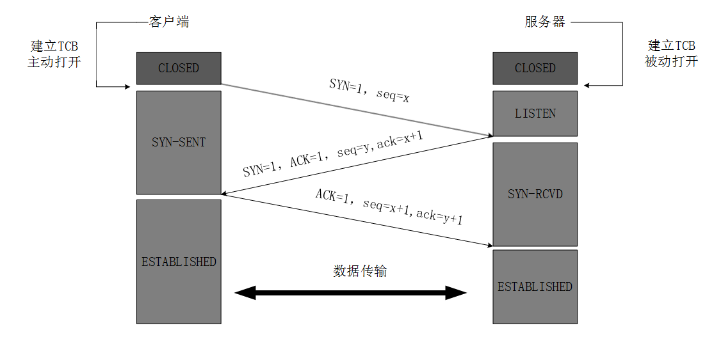
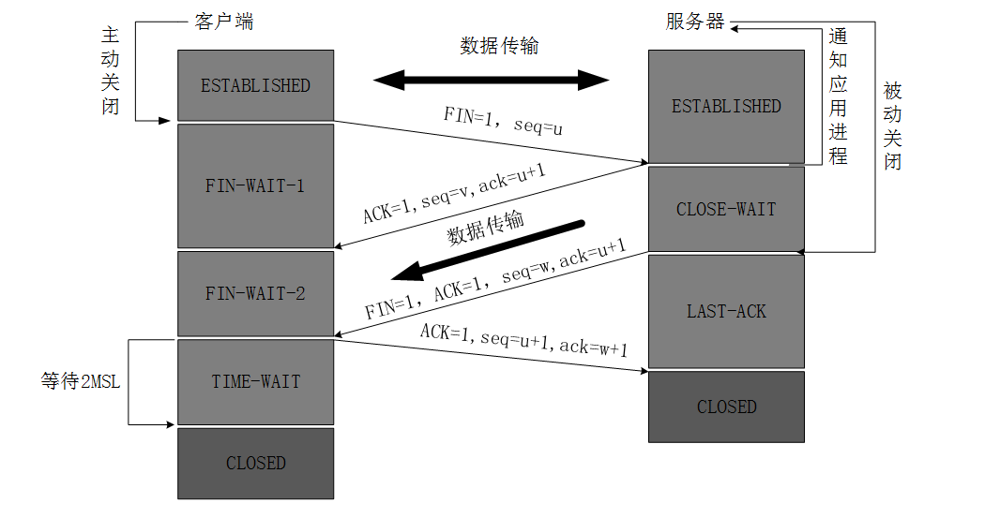

# TCP握手挥手

#### 一、基础（标识位和缩写）

首先，来认识一下握手挥手中用到的一些标识位和缩写的含义：

* SYN：标识位，表示建立链接
* ACK：标识位，表示响应
* FIN：标识位，表示关闭链接
* seq：顺序号码（TCP连接中传送的字节流中的每个字节都按顺序编号）
* ack：确认号码，是期望收到对方下一个报文的第一个数据字节的序号

#### **二、TCP**连接的建立**（**<mark style="color:red;">**三次握手**</mark>**）**：

**Why**：客户端和服务器都需要知道双方可收发，因此需要三次握手（让我知道你已经知道了）

**TCP客户端最后还要发送一次确认的目的**：防止已经失效的连接请求报文突然又传送到服务器，从而导致不必要的错误和资源的浪费。

注：最开始的时候客户端和服务器都是处于CLOSED状态。主动打开连接的为客户端，被动打开连接的是服务器。

****:star:**三次握手过程:**

1. TCP服务器进程先创建传输控制块TCB，时刻准备接受客户进程的连接请求，此时服务器就进入了LISTEN（监听）状态；
2. &#x20;TCP客户进程也是先创建传输控制块TCB，然后向服务器发出连接请求报文，这是报文首部中的同部位SYN=1，同时选择一个初始序列号 seq=x ，此时，TCP客户端进程进入了 SYN-SENT（同步已发送状态）状态。TCP规定，SYN报文段（SYN=1的报文段）不能携带数据，但需要消耗掉一个序号。&#x20;
3. TCP服务器收到请求报文后，如果同意连接，则发出确认报文。确认报文中应该 ACK=1，SYN=1，确认号是ack=x+1，同时也要为自己初始化一个序列号 seq=y，此时，TCP服务器进程进入了SYN-RCVD（同步收到）状态。这个报文也不能携带数据，但是同样要消耗一个序号。&#x20;
4. TCP客户进程收到确认后，还要向服务器给出确认。确认报文的ACK=1，ack=y+1，自己的序列号seq=x+1，此时，TCP连接建立，客户端进入ESTABLISHED（已建立连接）状态。TCP规定，ACK报文段可以携带数据，但是如果不携带数据则不消耗序号。&#x20;
5. 当服务器收到客户端的确认后也进入ESTABLISHED状态，此后双方就可以开始通信了。

#### **三、TCP**连接的释放（<mark style="color:red;">**四次挥手**</mark>**）**：

**TCP客户端最后还要等待2\*MSL（最长报文段寿命）的目的**：保证客户端发送的最后一个ACK报文能够达到服务器；防止已经失效的关闭连接报文段出现在本连接中。

**注**：数据传输完毕后，双方都可释放连接。最开始的时候，客户端和服务器都是处于ESTABLISHED状态，然后客户端主动关闭，服务器被动关闭。

:star:**四次挥手过程:**

1. 客户端进程发出连接释放报文，并且停止发送数据。释放数据报文首部，FIN=1，其序列号为seq=u（等于前面已经传送过来的数据的最后一个字节的序号加1），此时，客户端进入FIN-WAIT-1（终止等待1）状态。 TCP规定，FIN报文段即使不携带数据，也要消耗一个序号。&#x20;
2. 服务器收到连接释放报文，发出确认报文，ACK=1，ack=u+1，并且带上自己的序列号seq=v，此时，服务端就进入了CLOSE-WAIT（关闭等待）状态。TCP服务器通知高层的应用进程，客户端向服务器的方向就释放了，这时候处于半关闭状态，即客户端已经没有数据要发送了，但是服务器若发送数据，客户端依然要接受。这个状态还要持续一段时间，也就是整个CLOSE-WAIT状态持续的时间。&#x20;
3. 客户端收到服务器的确认请求后，此时，客户端就进入FIN-WAIT-2（终止等待2）状态，等待服务器发送连接释放报文（在这之前还需要接受服务器发送的最后的数据）。
4. 服务器将最后的数据发送完毕后，就向客户端发送连接释放报文，FIN=1，ack=u+1，由于在半关闭状态，服务器很可能又发送了一些数据，假定此时的序列号为seq=w，此时，服务器就进入了LAST-ACK（最后确认）状态，等待客户端的确认。&#x20;
5. 客户端收到服务器的连接释放报文后，必须发出确认，ACK=1，ack=w+1，而自己的序列号是seq=u+1，此时，客户端就进入了TIME-WAIT（时间等待）状态。注意此时TCP连接还没有释放，必须经过2∗ \*∗MSL（最长报文段寿命）的时间后，当客户端撤销相应的TCB后，才进入CLOSED状态。
6. 服务器只要收到了客户端发出的确认，立即进入CLOSED状态。同样，撤销TCB后，就结束了这次的TCP连接。可以看到，服务器结束TCP连接的时间要比客户端早一些。&#x20;

#### 四、Q\&A

**Q1**：如果已经建立了连接，但客户端突然出现故障怎么办？

**A1**: TCP设有一个保活计时器，服务器每收到一次客户端的请求后都会重新复位这个计时器，时间通常设置为2h，若2h之内还没有收到客户端的任何数据，服务器就会发送一个探测报文，之后每隔75s发送一次。若连续发送10个探测报文仍没有回应，服务器就认为客户端出现故障，接着就关闭连接。

**Q2**：为什么建立连接是三次握手，关闭连接是四次挥手？

**A2**: 建立连接的时候，服务器出于监听状态，一旦收到客户端建立连接请求的SYN报文后，可直接将SYN和ACK放在一个报文中返回客户端。而关闭连接时，服务器收到客户端关闭连接的FIN报文时仅仅表示对方不再发送数据但仍能接受数据，而自己的数据也未必全部发送给对方了，所以此时发送完数据给对方后，再向客户端发送FIN报文来表示同意现在关闭连接，ACK和FIN的分开发送导致挥手比握手多了一次。

**参考**：[两张动图-彻底明白TCP的三次握手与四次挥手](https://blog.csdn.net/qzcsu/article/details/72861891)（这篇博客讲的非常好，大家可以看看原文加深理解）
