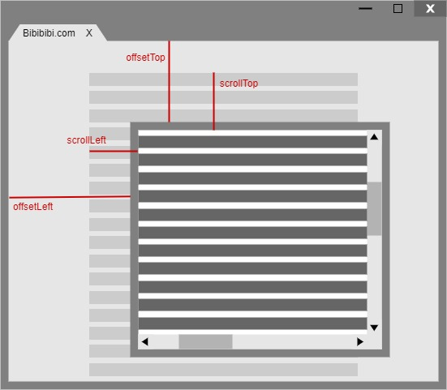

# Web-API

### **一、clientHeight, scrollHeight, offsetHeight ,以及scrollTop, offsetTop, clientTop的区别？**

clientHeight：可视区域高度，不包含border和滚动条\
offsetHeight： 可视区域高度，包含border和滚动条\
scrollHeight：所有区域高度，包含因滚动被隐藏的部分\
clientTop：边框border的厚度\
scrollTop：滚动后被隐藏的高度，获取对象最顶端与窗口中可见内容最顶端之间的距离\
offsetTop：获取指定对象相对于版面或布局中设置position属性的父容器顶端位置的距离



### **二、什么是事件委托/事件代理？典型例子？**&#x20;

**定义**：不在事件发生的直接DOM上设置监听函数，而在其父元素上设置监听函数，通过事件冒泡，父元素可以监听到子元素上事件的触发，通过判断事件发生元素DOM的类型（使用target属性），来做出不同的响应。

**好处**：新增子对象时无需再次对其绑定事件，适合动态添加元素；减少事件注册，减少内存消耗。

**举例**：ul和li标签的事件监听（不在li标签上直接添加事件监听而是在ul标签上添加）

### **三、什么是事件监听**&#x20;

<mark style="color:orange;">**element.addEventListener**</mark><mark style="color:orange;">(event, function, useCapture)</mark> 用于向指定元素添加事件&#x20;

* event：事件类型，如click、scroll、mousedown、resize等&#x20;
* function：事件触发后调用的函数&#x20;
* useCapture：描述事件传递方式，可选。默认为false即冒泡传递；true时为捕获传递

### **四、说一下JS的事件模型**

1.  事件模型

    *   DOM0事件模型/原始事件模型：事件不会传播，仅作为元素的一个属性

        直接在HTML中绑定：

        ```
        ```

    &#x20;\`\`\`

    通过js代码指定属性值：

    ```
    var btn = document.getElementById('.btn'); btn.onclick = fun;
    ```

    移除监听函数：

    ```
    btn.onclick=null;
    ```

    * IE事件模型：事件处理阶段→事件冒泡阶段（目标元素→document） 绑定：attachEvent(eventType, handler) 移除：detachEvent(eventType, handler)
    * DOM2事件模型：事件捕获阶段→事件处理阶段→事件冒泡阶段（document→目标元素→document） 绑定：addEventListener(eventType, handler, useCapture) 移除：removeEventListener(eventType, handler, useCapture)
2. 事件对象
   * DOM事件模型中的事件对象常用属性 type获取事件类型 target获取事件的目标节点 stopPropagation()阻止捕获和冒泡阶段中当前事件的进一步传播 preventDefault()阻止事件默认行为而不停止事件的进一步传播
   * IE事件模型中的事件对象常用属性 type获取事件类型 srcElement获取事件目标 cancelBubble阻止事件冒泡 returnValue阻止事件默认行为
3.  执行顺序

    如果一个DOM节点同时绑定了多个事件监听函数，且有的用于捕获，有的用于冒泡，则绑定在被点击元素上的事件是按照代码添加顺序执行的，其他先捕获再冒泡。

### **五、mouseover和mouseenter的区别**

mouseover/mouseout：当鼠标移入元素或其子元素都会触发事件，有一个重复触发的冒泡过程

mouseenter/mouseleave：当鼠标移入元素本身（不包含元素的子元素）会触发事件，即不会冒泡

### **六、setTimeout、setInterval和requestAnimationFrame**

|             名称            |                                                                                         说明                                                                                        |
| :-----------------------: | :-------------------------------------------------------------------------------------------------------------------------------------------------------------------------------: |
|  setTimeout/clearTimeout  |                                                                                     延时执行参数指定代码                                                                                    |
| setInterval/clearInterval |                                                                                    每隔一段时间执行指定代码                                                                                   |
|   requestAnimationFrame   | 在浏览器每次刷新页面之前执行：1. 会把每一帧中所有的DOM操作集中起来，在一次重绘或回流中就完成，并且重绘或回流的时间间隔紧紧跟随浏览器的刷新频率；2. 对于隐藏元素不会进行重绘或回流，减少了CPU、GPU和内存使用量；3. 由浏览器专门为动画提供的API，在运行时浏览器会自动优化方法的调用；页面如果不是激活状态，动画会暂停播放，有效节省了CPU开销 |

### **七、高频度触发事件的优化方案**

| 方案         | 说明                    | 应用场景          |
| ---------- | --------------------- | ------------- |
| 防抖debounce | 抖动结束的时间超过指定时间间隔时才执行任务 | 搜索联想、窗口resize |
| 节流throttle | 指定时间间隔内只执行一次任务        | 滚动事件、鼠标不断点击触发 |

### **八、**<mark style="color:red;">**跨域**</mark>**原理？js实现跨域？**

**跨域**：浏览器不能执行其他网站的脚本，是由浏览器的同源策略造成的，是浏览器对JS实施的安全限制\
（只要协议、域名、端口有任何一个不同，都被当作是不同的域）

**跨域原理**：通过各种方式避开浏览器的安全限制

**实现方法**：CORS；代理服务器；JSONP；document.domain+iframe；location.hash+iframe；window.name+iframe；postMessage

****
