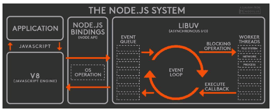
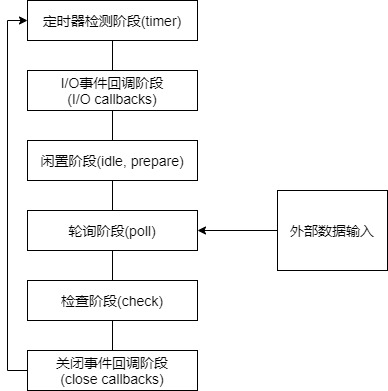
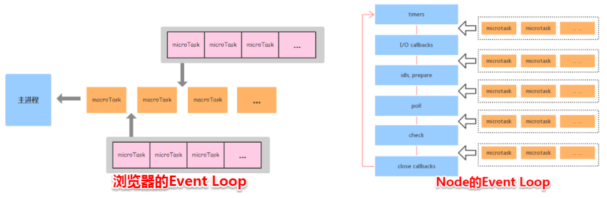

# 异步

### **十六、如何解决js加载过程**<mark style="color:red;">**阻塞**</mark>**问题？**

1. 将script标签放到body底部：此时DOM已加载完毕因此不存在阻塞问题（并非异步策略）
2.  **异步加载**外部js文件：defer、async

    <mark style="color:red;">**defer**</mark>**属性**：给script标签设置defer属性，将脚本文件设置为**延迟加载**，遇到带有defer属性的script标签时，浏览器会**再开启一个线程去下载js文件**，<mark style="color:orange;">同时继续解析HTML文档</mark>，**等HTML**全部**解析完毕**DOM加载完成后，**再去执行加载好的js文件**，可以**保证多个js文件的执行顺序**就是它们在页面中的出现顺序。\
    <mark style="color:red;">**async**</mark>**属性**：类似于defer属性，但与defer不同的是，它会在**下载完毕后立刻执行**。对于多个带有async的js文件，**不保证按顺序执行**，哪个js文件先下载完就先执行哪个。

****

### **三十二、为什么js是单线程？**&#x20;

JavaScript作为浏览器脚本语言，主要用途是与用户互动，以及操作DOM，这决定了它只能是单线程，否则会带来很复杂的同步问题。比如若js同时拥有两个线程，一个线程在某个DOM节点上添加内容，另一个线程删除这个节点，那浏览器将不知所措。为了利用多核CPU的计算能力，HTML5提出Web Worker标准，允许JS脚本创建多个线程，但子线程完全受主线程控制，且不得操作DOM，所以该标准并没有改变JS单线程的本质。

### **三十三、什么是Web Worker？使用Web Worker有什么注意点？**&#x20;

Web Worker的作用是为JS创建多线程环境，允许主线程创建Worker线程，将一些任务分配给线程运行。主线程运行的同时，Worker线程在后台运行，两者互不干扰；Worker线程完成计算任务后，再把结果返回给主线程。

**注意点**：

* 同源限制：分配给worker线程运行的脚本文件必须和主线程的脚本文件同源
* DOM限制：worker线程无法读取主线程所在网页的DOM对象，无法使用document、window对象，但可以使用navigator、location对象
* 通信限制：worker线程和主线程不在同一上下文环境，不能直接通信，须通过消息完成
* 文件限制：worker线程无法读取本地文件，所加载的脚本必须来自网络

### **三十六、什么是promise？**

1. Promise是一个构造函数，用来生成promise实例
2. 构造函数接收一个参数，这个参数是一个函数，当创建实例的时候，该作为参数的函数里的内容会立即执行
3. 参数里面的函数又接收两个参数，两个参数均为函数，一个为resolve，一个为reject
4. 异步操作成功时调用resolve，resolve函数将promise对象的状态从pending变为resolved并将结果作为参数传出去
5. 异步操作失败时调用reject，reject函数将promise对象的状态从pending变为rejected，并将操作报出的错误作为结果传递出去
6. 实例生成后，可以用then方法分别指定resolved状态和rejected状态的回调函数
7. then方法接收两个函数作为参数，分别为resolved和rejected的回调函数，第二个参数可选
8. catch方法在then方法后调用，发生错误时调用，本质上等同于then(null, rejected);

**Promise特点**：

* 三种状态：pending、resolved（fulfilled）、rejected
* 对象的状态不受外部影响，只有异步操作的结果才能决定当前是哪一种状
* 一旦状态改变就凝固了，不会再改变（pending→resolved；pending→rejected）

**参考**：[ES6基础之详解Promise基本用法](https://blog.csdn.net/zhy13087344578/article/details/78132105)

### **三十七、async和await如何使用？**

async关键字用于声明一个function是异步的，被async修饰的函数返回的是一个promise；

await只能在async函数中使用，用于等待一个异步方法执行完成，await等待的内容可以是常量、变量、promise、函数等。

async/await中的错误处理：使用try-catch来错误捕捉；使用promise的catch来错误捕捉

_参考_：[理解async/await](https://juejin.im/post/5d9e8539f265da5b8a515e63)

### **三十九、浏览器中的Event Loop事件循环**

JavaScript：单线程（代码执行时只有一个主线程来处理所有任务）非阻塞（当代码需要进行一项异步任务时，主线程挂起该任务，然后在异步任务返回结果的时候再根据一定规则去执行相应的回调→Event Loop）

.png>)

1. 任务队列
   * **Macrotask（宏任务）**：script（整体代码）、setTimeout、setInterval、I/O、UI交互事件、postMessage、MessageChannel
   * **Microtask（微任务）**：Promise.then、Object.observe
2.  事件循环执行流程

    一次事件循环只执行位于Macrotask队首的任务，执行完成后立即执行Microtask队列中的所有任务（一开始在js主线程中跑的任务就是Macrotask任务，因此执行完主线程的代码后，会从Microtask队列中取任务来执行）
3.  定时器问题：setTimeout不保证可靠定时

    定时器中设置的时间仅保证任务会在delay毫秒后进入Macrotask队列，并不意味着它能立刻运行，因为可能当前主线程正在进行一个耗时的操作，也可能目前Microtask队列中有很多个任务。
4.  Js是阻塞还是非阻塞的？

    核心是同步阻塞，而对于js异步事件，因为有事件循环机制，所以异步事件就是由事件驱动异步非阻塞的
5.  requestAnimationFrame既不属于Microtask也不属于Macrotask

    同步任务→promise等微任务→制作render树→requestAnimationFrame→制作render树→第一帧重绘完成→setTimeout等宏任务

### **四十、Node中的Event Loop事件循环**

1.  Node简介

    Node.js采用V8作为js的解析引擎，而I/O处理方面使用libuv，libuv是一个基于事件驱动的跨平台抽象层，封装了不同操作系统一些底层特性，对外提供统一的API，事件循环机制由它实现
2. Node.js运行机制
   * V8引擎解析JavaScript脚本
   * 解析后的代码调用Node API
   * libuv库负责Node API的执行，它将不同的任务分配给不同的线程，形成一个事件循环，以异步的方式将任务的执行结果返回给V8引擎
   * V8引擎将结果返回用户
   * 
3.  事件循环六个阶段

    libuv中的事件循环分六个阶段，它们会按照顺序反复运行，每当进入某一个阶段的时候，都会从对应的回调队列中取出函数去执行。当队列为空或者执行的回调函数数量达到系统设定的阈值，就会进入下一阶段。

    * ​
    * **timers阶段**\
      执行setTimeout()、setInterval()的回调，由poll阶段控制（与浏览器不同，timers阶段有几个setTimeout、setInterval都会依次执行）
    * **I/O callbacks阶段**：处理上一轮循环中少数未执行的I/O回调
    * **idle，prepare阶段**：仅node内部使用
    *   **poll阶段**\
        获取新的I/O事件，适当的条件下node将阻塞在这里。该阶段系统会做两件事：回到timer阶段执行回调；执行I/O回调。在进入该阶段时：

        如果没有设定timer，则：1.若poll队列不为空，会遍历回调队列并同步执行，直到队列为空或者达到系统限制；2.若poll队列为空，则（1）若有setImmediate回调需要执行，poll阶段会停止并且进入到check阶段执行回调；（2）若没有setImmediate回调需要执行，会等待回调被加入到队列中并立即执行回调，同时会有个超时时间防止死等。

        如果设定了timer且poll队列为空，则会判断是否有timer超时，如果有的话会回到timer阶段执行回调
    * **check阶段**：执行setImmediate()的回调
    * **close callbacks阶段**：执行socket的close事件回调
4.  **MicroTask**与**MacroTask**（**微命令**和**宏命令**）

    MacroTask：setTimeout、setInterval、setImmediate、script（整体代码）、I/O操作\
    MicroTask：process.nextTick、Promise().then
5.  注意点

    setTimeout和setImmediate\
    两者调用时机不同，setImmediate设计在poll阶段完成时执行，即check阶段；setTimeout设计在poll阶段为空闲时，且设定时间达到后在timer阶段执行。二者在异步I/O callbacks内部调用时，总是先执行setImmediate再执行setTimeout；其他情况先后顺序不一定（setTimeout(func, 0)===setTimeout(func, 1)，如果在准备时候花费时间大于1ms，则在timers阶段就会直接执行setTimeout回调，小于1ms先执行setImmediate回调）

    process.nextTick\
    独立于Event Loop之外，有一个自己的队列，当每个阶段完成后如果存在nextTick队列，就会转而清空nextTick队列中的所有回调函数，且优先于其他microtask执行。

### **四十一、Node与浏览器的Event Loop差异**

Microtask任务队列的执行时机不同

* Node端：microtask在事件循环的各个阶段之间执行
* 浏览器端：microtask在事件循环的macrotask执行完之后执行

参考：

[面试一定会问到的-js事件循环](https://juejin.im/post/5da742936fb9a04e223333ff)

[浏览器与Node的事件循环(Event Loop)有何区别?](https://juejin.im/post/5c337ae06fb9a049bc4cd218)

[【js事件循环】+ requestAnimationFrame与页面绘制在事件循环中的顺序关系](https://blog.csdn.net/weixin\_42476799/article/details/102893692)
