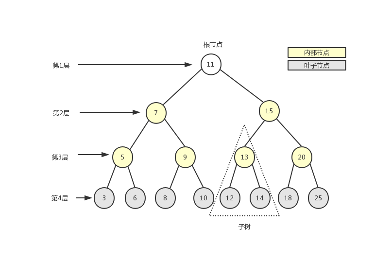

# JS中的数据结构

__[_JavaScript中的6种常见数据结构_](https://blog.csdn.net/aaahuahua/article/details/120506103?spm=1001.2101.3001.6650.5\&utm\_medium=distribute.pc\_relevant.none-task-blog-2%7Edefault%7EBlogCommendFromBaidu%7Edefault-5-120506103-blog-107789164.pc\_relevant\_multi\_platform\_whitelistv3\&depth\_1-utm\_source=distribute.pc\_relevant.none-task-blog-2%7Edefault%7EBlogCommendFromBaidu%7Edefault-5-120506103-blog-107789164.pc\_relevant\_multi\_platform\_whitelistv3\&utm\_relevant\_index=7) __ （栈、队列、集合依赖JS对象Array和Set）

[_Javascript中的8种常见数据结构_](https://blog.csdn.net/weixin\_48726650/article/details/107789164) **** （完全独立实现）

_****_[_**JavaScript 算法与数据结构**_](https://github.com/trekhleb/javascript-algorithms/blob/master/README.zh-CN.md)  _****_**  (更全的仓库)**

* [1、Queue 队列](js-zhong-de-shu-ju-jie-gou.md#1queue-dui-lie)
* [2、Stack 栈](js-zhong-de-shu-ju-jie-gou.md#t2)
* [3、Linked List 链表](js-zhong-de-shu-ju-jie-gou.md#3linked-list-lian-biao)
* [4、Set 集合](js-zhong-de-shu-ju-jie-gou.md#t4)
* [5、Map 字典](js-zhong-de-shu-ju-jie-gou.md#5map-zi-dian)
* [6、Hash table 哈希表](js-zhong-de-shu-ju-jie-gou.md#t5)
* [7、Tree 树](js-zhong-de-shu-ju-jie-gou.md#t5)
* [8、Trie 前缀树/字典树](js-zhong-de-shu-ju-jie-gou.md#7trie-qian-zhui-shu-zi-dian-shu)
* [9、Heap 堆](js-zhong-de-shu-ju-jie-gou.md#t6)
* [10、Graph 图](js-zhong-de-shu-ju-jie-gou.md#undefined)

### 1、Queue [队列](https://so.csdn.net/so/search?q=%E9%98%9F%E5%88%97\&spm=1001.2101.3001.7020)

JavaScript中没有队列这个数据结构，但是可以用**数组**来实现所有的功能。\


队列是一个**先进先出**的数据结构，一般JavaScript中采用队列解决问题时会用到

1. `入队`<mark style="color:red;">`push ()`</mark>：在数组的尾部添加元素
2. `出队`<mark style="color:red;">`shift ()`</mark>：移除数组中第一个元素
3. <mark style="color:red;">`queue (0)`</mark> ：取数组的第一个元素
4. <mark style="color:red;">`isEmpty ()`</mark>：确定队列是否为空
5. <mark style="color:red;">`size ()`</mark>：获取队列中元素的数量

### 2、Stack 栈 <a href="#t2" id="t2"></a>

**1️⃣**栈作为一种数据结构，是一种只能在一端进行插入和删除操作的特殊线性表。它按照**先进⬇后出**⬆的原则存储数据，先进入的数据被压入栈底，最后的数据在栈顶，需要读数据的时候从栈顶开始弹出数据（最后一个数据被第一个读出来）。


**2️⃣**JavaScript中没有栈，但是可以用**数组**（Array）实现栈的功能。

**3️⃣**栈中数组长度减一即为栈尾元素，也就是最后进入的那个元素，最先出去的那个元素

JavaScript中对栈的操作一般会使用到

1. <mark style="color:red;">`push()`</mark>方法，将元素压入栈顶
2. <mark style="color:red;">`pop()`</mark>方法，从栈顶弹出（删除）元素，并返回该元素
3. <mark style="color:red;">`peek()`</mark>方法，返回栈顶元素，不删除
4. <mark style="color:red;">`clear()`</mark>方法，清空栈
5. <mark style="color:red;">`length`</mark>拿到栈中元素数量

### 3、Linked List 链表

__[_JavaScript数据结构——链表的实现与应用_ ](https://www.cnblogs.com/jaxu/p/11277732.html)__

**链表**是由多个元素组成的列表，链表中的元素储存不连续，用**next指针**连接在一起。\


**数组**：增删非数组元素需要移动元素

**链表**：增删非首尾元素不需要移动元素只需要更改next的指向即可

链表是一个链式数据结构，每个节点由两个信息组成：节点的数据和指向下一个节点的指针。链表和传统数组都是线性数据结构，具有序列化的存储方式。

| 操作      | 数组            | 链表                   |
| ------- | ------------- | -------------------- |
| 内存分配    | 编译和序列化过程中静态分配 | 运行过程中动态分配            |
| 获取元素    | 从索引中读取        | 读取队列中的所有节点，直到特定元素，较慢 |
| 增加/删除元素 | 顺序增加删除，较慢     | 动态分配，内存消耗小，速度快       |
| 空间结构    | 一维或者多维        | 单边/多边，循环链表           |

**JavaScript**中没有链表，可以用<mark style="color:red;">class</mark>来实现：

```javascript
// 链表节点类
class ListNode {
  val;
  next = null;
  constructor(value) {
    this.val = value;
    this.next = null;
  }
}
```

```javascript
// 链表类
class LinkedList {
    constructor() {
        this.length = 0;
        this.head = null;
    }

    // 向链表中添加节点
    append (element) {
        let node = new Node(element);
    
        // 如果当前链表为空，则将head指向node
        if (this.head === null) this.head = node;
        else {
            // 否则，找到链表尾部的元素，然后添加新元素
            let current = this.getElementAt(this.length - 1);
            current.next = node;
        }
    
        this.length++;
    }

    // 在链表的指定位置插入节点
    insert (position, element) {
        // position不能超出边界值
        if (position < 0 || position > this.length) return false;
    
        let node = new Node(element);
    
        if (position === 0) {
            node.next = this.head;
            this.head = node;
        }
        else {
            let previous = this.getElementAt(position - 1);
            node.next = previous.next;
            previous.next = node;
        }
    
        this.length++;
        return true;
    }

    // 删除链表中指定位置的元素，并返回这个元素的值
    removeAt (position) {
        // position不能超出边界值
        if (position < 0 || position >= this.length) return null;
    
        let current = this.head;
    
        if (position === 0) this.head = current.next;
        else {
            let previous = this.getElementAt(position - 1);
            current = previous.next;
            previous.next = current.next;
        }
    
        this.length--;
        return current.element;
    }

    // 删除链表中对应的元素
    remove (element) {
        let index = this.indexOf(element);
        return this.removeAt(index);
    }

    // 在链表中查找给定元素的索引
    indexOf (element) {
        let current = this.head;
    
        for (let i = 0; i < this.length; i++) {
            if (current.element === element) return i;
            current = current.next;
        }
    
        return -1;
    }

    // 返回链表中索引所对应的元素
    getElementAt (position) {
        if (position < 0 || position >= this.length) return null;
    
        let current = this.head;
        for (let i = 0; i < position; i++) {
            current = current.next;
        }
        return current;
    }

    // 判断链表是否为空
    isEmpty () {
        // return this.head === null;
        return this.length === 0;
    }

    // 返回链表的长度
    size () {
        return this.length;
    }

    // 返回链表的头元素
    getHead () {
        return this.head;
    }

    // 清空链表
    clear () {
        this.head = null;
        this.length = 0;
    }

    // 辅助方法，按指定格式输出链表中的所有元素，方便测试验证结果
    toString () {
        let current = this.head;
        let s = '';

        while (current) {
            let next = current.next;
            next = next ? next.element : 'null';
            s += `[element: ${current.element}, next: ${next}] `;
            current = current.next;
        }

        return s;
    }
}
```

### 4、Set [集合](https://so.csdn.net/so/search?q=%E9%9B%86%E5%90%88\&spm=1001.2101.3001.7020) <a href="#t4" id="t4"></a>

**集合**：一种无序且唯一的数据结构，集合区别队列、栈、链表最大的区别就是元素不能重复

JavaScript中ES6中新增了集合这种数据结构，可以通过实例化Set对象来创建集合：&#x20;

<mark style="color:orange;">`const set = new Set()`</mark>

#### Set 对象的方法和属性

| new Set() | 创建新的 Set 对象。    |
| --------- | --------------- |
| add()     | 向 Set 添加新元素。    |
| clear()   | 从 Set 中删除所有元素。  |
| delete()  | 删除由其值指定的元素。     |
| entries() | 返回 Set 对象中值的数组。 |
| has()     | 如果值存在则返回 true。  |
| forEach() | 为每个元素调用回调。      |
| keys()    | 返回 Set 对象中值的数组。 |
| values()  | 与 keys() 相同。    |
| size      | 返回元素计数。         |

#### 集合常用来解决的问题：

1. 去重\
   `set = new Set(arr)`，返回一个不含重复元素的集合
2. 判断元素是否在集合中\
   `set.has(num)`，判断num是否在集合中
3. 求两个集合的交集\
   先将集合set1转换为数组，然后利用数组中的filter方法将set1在set2中的值返回，最后将返回的值转换为集合

```javascript
const set1 = new Set([1,2,4])
const set2 = new Set([3,4])
const set3 = new Set([...set1].filter(item = > set2.has(item)))
//set3{4}
```

&#x20; 4\. 求两个集合的并集

```javascript
const set1 = new Set([1,2,4])
const set2 = new Set([3,4])
let set3 = new Set([...set1, ...set2]);
// set3 {1, 2, 3, 4}
```

&#x20;5\. 求两个集合的差集

```javascript
const set1 = new Set([1,2,4])
const set2 = new Set([3,4])
let set3 = new Set([...set1].filter(x => !set2.has(x)));
// set3 {1,2}
```

**filter**() 方法创建一个新的数组，新数组返回指定数组中符合条件的所有元素

`...`是ES6中新增的扩展运算符，对象中的扩展运算符(…)用于取出参数对象中的所有可遍历属性，拷贝到当前对象之中。`[...set]`的意思就是将集合转换为数组

### 5、Map 字典

Map 对象存有键值对，其中的键可以是任何数据类型。

Map 对象记得键的原始插入顺序。

Map 对象具有表示映射大小的属性。

#### 基本的 Map() 方法

| Method    | Description        |
| --------- | ------------------ |
| new Map() | 创建新的 Map 对象。       |
| set()     | 为 Map 对象中的键设置值。    |
| get()     | 获取 Map 对象中键的值。     |
| entries() | 返回 Map 对象中键/值对的数组。 |
| keys()    | 返回 Map 对象中键的数组。    |
| values()  | 返回 Map 对象中值的数组。    |

#### Map() 属性

| Property | Description     |
| -------- | --------------- |
| size     | 获取 Map 对象中某键的值。 |

#### 创建 Map 对象

能够使用**对象**作为**键**是 Map 的一个重要特性：

```javascript
// 创建对象
const apples = {name: 'Apples'};
const bananas = {name: 'Bananas'};
const oranges = {name: 'Oranges'};

// 创建新的 Map
const fruits = new Map();

// Add new Elements to the Map
fruits.set(apples, 500);
fruits.set(bananas, 300);
fruits.set(oranges, 200);
```

也可以将 Array 传递给 `new Map()` 构造函数：

```javascript
// 返回
const apples = {name: 'Apples'};
const bananas = {name: 'Bananas'};
const oranges = {name: 'Oranges'};

// 创建新的 Map
const fruits = new Map([;
  [apples, 500],
  [bananas, 300],
  [oranges, 200]
]);
```

#### 获取键的值

get() 方法获取 Map 中键的值：

```javascript
fruits.get(apples);    // 返回 500
```

Remember: The key is an object (apples), not a string ("apples"):

```javascript
fruits.get("apples");  // 返回 undefined
```

### 6、Hash table 哈希表 <a href="#t5" id="t5"></a>


**哈希表**是一种**键值数据结构**。由于通过键值查询的速度快如闪电，所以常用于**Map、Dictionary或Object**数据结构中。如上图所示，哈希表使用哈希函数(`hash function`)将键转换为数字列表，这些数字作为对应键的值。要快速使用键获取价值，时间复杂度可以达到O(1)。相同的键必须返回相同的值——这是哈希函数的基础。

哈希表具有以下方法：

* `add`：添加键值对
* `remove`：删除键值对
* `lookup`：使用键查找对应的值

一个Javascript中简化的哈希表的例子：（[完整的实现](https://github.com/trekhleb/javascript-algorithms/blob/master/src/data-structures/hash-table/HashTable.js)）

```javascript
function hash(string, max) {
  var hash = 0;
  for (var i = 0; i < string.length; i++) {
    hash += string.charCodeAt(i);
  }
  return hash % max;
}

function HashTable() {
  let storage = [];
  const storageLimit = 4;

  this.add = function (key, value) {
    var index = hash(key, storageLimit);
    if (storage[index] === undefined) {
      storage[index] = [
        [key, value]
      ];
    } else {
      var inserted = false;
      for (var i = 0; i < storage[index].length; i++) {
        if (storage[index][i][0] === key) {
          storage[index][i][1] = value;
          inserted = true;
        }
      }
      if (inserted === false) {
        storage[index].push([key, value]);
      }
    }
  }

  this.remove = function (key) {
    var index = hash(key, storageLimit);
    if (storage[index].length === 1 && storage[index][0][0] === key) {
      delete storage[index];
    } else {
      for (var i = 0; i < storage[index]; i++) {
        if (storage[index][i][0] === key) {
          delete storage[index][i];
        }
      }
    }
  }

  this.lookup = function (key) {
    var index = hash(key, storageLimit);
    if (storage[index] === undefined) {
      returnundefined;
    } else {
      for (var i = 0; i < storage[index].length; i++) {
        if (storage[index][i][0] === key) {
          return storage[index][i][1];
        }
      }
    }
  }
}
```

### 7、Tree 树 <a href="#t5" id="t5"></a>

[_JavaScript数据结构——树的实现_](https://www.cnblogs.com/jaxu/p/11309385.html)__

前端🎄树结构还是比较常见的，例如级联选择、层级目录等都是树形结构。

在计算机科学中，树是一种十分重要的数据结构。树被描述为一种分层数据抽象模型，常用来描述数据间的层级关系和组织结构。树也是一种非顺序的数据结构。下图展示了树的定义：

.png>)

#### **树的常用遍历方式**

**** (1).png>)****

&#x20;**1. 深度优先遍历**

尽可能深的遍历树的分支。先访问根节点，然后再对子节点挨个使用深度优先遍历。

上图中的树使用深度优先遍历

```javascript
const deepNood = (node)=>{
//打印根节点
    console.log(node.values);
    //遍历子节点
    node.children.forEach(child => {
    //递归
        deepNood(child)
    })
}
deepNood(tree)
//a b d e f c g h
```

&#x20;**2. 广度优先遍历**

优先访问距离根节点最近的节点。广度优先遍历需要使用到队列这个数据结构

* 新建一个队列，把根节点入队
* 将队头出队并访问
* 将队头的children顺序入队
* 重复第二步和第三步，直到队列为空

上面的树使用广度优先遍历

```javascript
const breadth = (node)=>{
//将树加入队列（整个object对象，）
    const arr = [node];
//队列是否为空
    while(arr.length > 0){
    //从队列中取出根节点
        const val = arr.shift()
        console.log(val.values)
        //遍历子节点
        for(let child of val.children){
        //将子节点加入队列
            arr.push(child)
        }
 // 打开console.log(arr),就能看出不断的将childern入队，然后再将队头取出
    }
}
breadth(tree)
//a b c d e f g h 
```

#### **二叉树**

二叉树是n(n>=0)个结点的有限集合，该集合或者为空集（称为空二叉树），或者由一个根结点和两棵互不相交的、分别称为根结点的左子树和右子树组成。左右子节点的顺序不能颠倒。

树的每个节点最多只能有两个子节点。\


**二叉搜索树**（BST——Binary Search Tree）是**二叉树**的一种，它规定在左子节点上存储小（比父节点）的值，在右子节点上（比父节点）存储大（或等于）的值。上图就是一个二叉搜索树。

下面重点来看一下二叉搜索树的实现。

根据二叉树的描述，一个节点最多只有两个子节点，我们可以使用[《JavaScript数据结构——链表的实现与应用》](https://www.cnblogs.com/jaxu/p/11277732.html)一文中的双向链表来实现二叉搜索树中的每一个节点。下面是二叉搜索树的数据结构示意图：

.png>)

```javascript
// 二叉树搜索树(BST)及常用方法的js实现 
class Node {
  constructor(data, left = null, right = null) {
    this.data = data;
    this.left = left;
    this.right = right;
  }
}

class BST {
  constructor() {
    this.root = null;
  }

  add(data) {
    const node = this.root;
    if (node === null) {
      this.root = new Node(data);
      return;
    } else {
      const searchTree = function (node) {
        if (data < node.data) {
          if (node.left === null) {
            node.left = new Node(data);
            return;
          } else if (node.left !== null) {
            return searchTree(node.left);
          }
        } else if (data > node.data) {
          if (node.right === null) {
            node.right = new Node(data);
            return;
          } else if (node.right !== null) {
            return searchTree(node.right);
          }
        } else {
          return null;
        }
      };
      return searchTree(node);
    }
  }

  findMin() {
    let current = this.root;
    while (current.left !== null) {
      current = current.left;
    }
    return current.data;
  }

  findMax() {
    let current = this.root;
    while (current.right !== null) {
      current = current.right;
    }
    return current.data;
  }

  search(data) {
    let current = this.root;
    while (current.data !== data) {
      if (data < current.data) {
        current = current.left
      } else {
        current = current.right;
      }
      if (current === null) {
        return null;
      }
    }
    return current;
  }

  isPresent(data) {
    let current = this.root;
    while (current) {
      if (data === current.data) {
        return true;
      }
      if (data < current.data) {
        current = current.left;
      } else {
        current = current.right;
      }
    }
    return false;
  }

  remove(data) {
    const removeNode = function (node, data) {
      if (node == null) {
        return null;
      }
      if (data == node.data) {
        // no child node
        if (node.left == null && node.right == null) {
          return null;
        }
        // no left node
        if (node.left == null) {
          return node.right;
        }
        // no right node
        if (node.right == null) {
          return node.left;
        }
        // has 2 child nodes
        var tempNode = node.right;
        while (tempNode.left !== null) {
          tempNode = tempNode.left;
        }
        node.data = tempNode.data;
        node.right = removeNode(node.right, tempNode.data);
        return node;
      } else if (data < node.data) {
        node.left = removeNode(node.left, data);
        return node;
      } else {
        node.right = removeNode(node.right, data);
        return node;
      }
    }
    this.root = removeNode(this.root, data);
  }
}
```

```javascript
// BinarySearchTree 另一种实现
  1 let insertNode = function (node, newNode) {
  2     if (newNode.element < node.element) {
  3         if (node.prev === null) node.prev = newNode;
  4         else insertNode(node.prev, newNode);
  5     }
  6     else {
  7         if (node.next === null) node.next = newNode;
  8         else insertNode(node.next, newNode);
  9     }
 10 };
 11 
 12 let preOrderTraverseNode = function (node, callback) {
 13     if (node !== null) {
 14         callback(node.element);
 15         preOrderTraverseNode(node.prev, callback);
 16         preOrderTraverseNode(node.next, callback);
 17     }
 18 };
 19 
 20 let inOrderTraverseNode = function (node, callback) {
 21     if (node !== null) {
 22         inOrderTraverseNode(node.prev, callback);
 23         callback(node.element);
 24         inOrderTraverseNode(node.next, callback);
 25     }
 26 };
 27 
 28 let postOrderTraverseNode = function (node, callback) {
 29     if (node !== null) {
 30         postOrderTraverseNode(node.prev, callback);
 31         postOrderTraverseNode(node.next, callback);
 32         callback(node.element);
 33     }
 34 };
 35 
 36 let minNode = function (node) {
 37     if (node === null) return null;
 38 
 39     while (node && node.prev !== null) {
 40         node = node.prev;
 41     }
 42     return node;
 43 };
 44 
 45 let maxNode = function (node) {
 46     if (node === null) return null;
 47 
 48     while (node && node.next !== null) {
 49         node = node.next;
 50     }
 51     return node;
 52 };
 53 
 54 let searchNode = function (node, key) {
 55     if (node === null) return false;
 56 
 57     if (key < node.element) return searchNode(node.prev, key);
 58     else if (key > node.element) return searchNode(node.next, key);
 59     else return true;
 60 };
 61 
 62 let removeNode = function (node, key) {
 63     if (node === null) return null;
 64 
 65     if (key < node.element) {
 66         node.prev = removeNode(node.prev, key);
 67         return node;
 68     }
 69     else if (key > node.element) {
 70         node.next = removeNode(node.next, key);
 71         return node;
 72     }
 73     else {
 74         // 第一种情况：一个叶子节点（没有子节点）
 75         if (node.prev === null && node.next === null) {
 76             node = null;
 77             return node;
 78         }
 79         // 第二种情况：只包含一个子节点
 80         if (node.prev === null) {
 81             node = node.next;
 82             return node;
 83         }
 84         else if (node.next === null) {
 85             node = node.prev;
 86             return node;
 87         }
 88 
 89         // 第三种情况：有两个子节点
 90         let aux = minNode(node.next);
 91         node.element = aux.element;
 92         node.next = removeNode(node.next, aux.element);
 93         return node;
 94     }
 95 };
 96 
 97 class BinarySearchTree {
 98     constructor () {
 99         this.root = null;
100     }
101 
102     // 向树中插入一个节点
103     insert (key) {
104         let newNode = new Node(key);
105 
106         if (this.root === null) this.root = newNode;
107         else insertNode(this.root, newNode);
108     }
109 
110     // 在树中查找一个节点
111     search (key) {
112         return searchNode(this.root, key);
113     }
114 
115     // 通过先序遍历方式遍历树中的所有节点
116     preOrderTraverse (callback) {
117         preOrderTraverseNode(this.root, callback);
118     }
119 
120     // 通过中序遍历方式遍历树中的所有节点
121     inOrderTraverse (callback) {
122         inOrderTraverseNode(this.root, callback);
123     }
124 
125     // 通过后序遍历方式遍历树中的所有节点
126     postOrderTraverse (callback) {
127         postOrderTraverseNode(this.root, callback);
128     }
129 
130     // 返回树中的最小节点
131     min () {
132         return minNode(this.root);
133     }
134 
135     // 返回树中的最大节点
136     max () {
137         return maxNode(this.root);
138     }
139 
140     // 从树中移除一个节点
141     remove (key) {
142         this.root = removeNode(this.root, key);
143     }
144 }
```

#### **二叉树遍历（递归）**

**（1）前序遍历**

**DLR**：根节点——左子树——右子树

每次遍历到一个节点都重复一次前序遍历

代码实现

```javascript
const perorder = (node) =>{
//如果当前节点值为空则返回
    if(!node) return;
    //打印根节点
    console.log(node.val);
    //递归左子树
    perorder(node.left);
    //递归右子树
    perorder(node.right);
}
perorder(tree)
//1 2 4 5 3 6 7
```

**（2）中序遍历**

**LDR**：左子树——根节点——右子树

每次遍历到一个节点都重复一次中序遍历

代码实现

```javascript
const perorder = (node) =>{
    if(!node)return;
    perorder(node.left);
    console.log(node.val);
    perorder(node.right);
}
perorder(tree)
//4 2 5 1 6 3 7
```

**（3）后序遍历**

**LRD**：左子树——右子树——根节点

每次遍历到一个节点都重复一次后序遍历

代码实现

```javascript
const perorder = (node) =>{
    if(!node)return;
    perorder(node.left);
    perorder(node.right);
    console.log(node.val);
}
perorder(tree)
//4 5 2 6 7 3 1
```

**注意：**\
前序遍历第一个为根节点\
中序遍历根节点左边为左子树，右边为右子树\
后序遍历最后一个为根节点

### 8、Trie 前缀树/**字典树**

&#x20;(Trie **** 发音为 “try”)&#x20;


**Trie**或“**前缀树**”也是**搜索树**的一种。Trie<mark style="color:red;">分步存储数据</mark>——<mark style="color:red;">树中的每个节点代表一个步骤</mark>。Trie是用来**存储词汇**的，所以它可以快速搜索，特别是自动完成功能。

Trie中的每个节点都有一个字母——分支之后可以组成一个完整的单词。它还包括一个布尔指示符，以显示这是否是最后一个字母。

Trie具有以下方法：

* `add`：在字典树中插入一个单词
* `isWord`：确定树是否由某些单词组成
* `print`：返回树中的所有单词

```javascript
/** Node in Trie **/
function Node() {
  this.keys = newMap();
  this.end = false;
  this.setEnd = function () {
    this.end = true;
  };
  this.isEnd = function () {
    returnthis.end;
  }
}

function Trie() {
  this.root = new Node();
  this.add = function (input, node = this.root) {
    if (input.length === 0) {
      node.setEnd();
      return;
    } elseif (!node.keys.has(input[0])) {
      node.keys.set(input[0], new Node());
      returnthis.add(input.substr(1), node.keys.get(input[0]));
    } else {
      returnthis.add(input.substr(1), node.keys.get(input[0]));
    }
  }
  this.isWord = function (word) {
    let node = this.root;
    while (word.length > 1) {
      if (!node.keys.has(word[0])) {
        returnfalse;
      } else {
        node = node.keys.get(word[0]);
        word = word.substr(1);
      }
    }
    return (node.keys.has(word) && node.keys.get(word).isEnd()) ? true : false;
  }
  this.print = function () {
    let words = newArray();
    let search = function (node = this.root, string) {
      if (node.keys.size != 0) {
        for (let letter of node.keys.keys()) {
          search(node.keys.get(letter), string.concat(letter));
        }
        if (node.isEnd()) {
          words.push(string);
        }
      } else {
        string.length > 0 ? words.push(string) : undefined;
        return;
      }
    };
    search(this.root, newString());
    return words.length > 0 ? words : null;
  }
}
```

### 9、Heap 堆 <a href="#t6" id="t6"></a>

堆是一种特殊的完全二叉树

每层节点全部都填满，最后一层如果不是满的，只能缺少右边的节点，下图为最大堆的示例\
\
所有的节点都大于等于（最大堆）或者小于等于（最小堆）他的子节点

**js中的堆**

js中通常用数组来表示堆，按照广度优先的方式存储在数组中

根据广度优先的特点可以得到子节点在数组中的存储位置（index代表当前节点在数组中的下标）

左侧子节点的位置是2 \* index+1\
右侧子节点的位置是2 \* index+1\
父节点位置是（index - 1）/ 2\


**第k个最大元素**

主要方法 ：

**插入元素**（最小堆）

构建一个最小堆，并将元素依次添加到堆中，

1. 将值插入堆的底部，也就是数组的尾部
2. 上移，将这个值与其父节点进行交换，直到父节点小于等于这个插入的值
3. 大小为k的堆中插入元素的时间复杂度为O(logk)

**删除堆顶**

当堆的容量超过了k就删除堆顶

1. 用数组尾部元素替换堆顶（直接删除堆顶会破坏堆解构）
2. 下移，将新堆顶和子节点进行交换，直到子节点大于这个堆顶
3. 大小为k的堆中删除堆顶的时间复杂度为O（logk）

**获取堆顶**

插入结束后堆顶就是第k个最大元素

**获取堆大小**

数组长度就是堆的大小

**代码实现最小堆类**

```javascript
class  minHeap{
    constructor(){
        this.heap = []; 
    }
    // 获取父节点在数组中的下标
    getParentIndex(i){
        return Math.floor((i-1)/2)
        //二进制写法
        // return (i - 1) >> 1
    }
    // 获取左侧节点在数组中的下标
    getLeftIndex(i){
        return i * 2 + 1
    }
    // 获取右侧节点在数组中的下标
    getRightIndex(i){
        return i * 2 + 2
    }

    // 定义节点交换的方法
    swap(i1,i2){
        const temp = this.heap[i1];
        this.heap[i1] = this.heap[i2];
        this.heap[i2] = temp;

    }
    // 定义上移方法
    shiftUp(index){
        if(index==0){
            return;
        }
        // 不停的和父节点交换位置，直到小于等于父节点的值
        const parentIndex = this.getParentIndex(index)
        if(this.heap[parentIndex] > this.heap[index]){
            this.swap(parentIndex,index)
            this.shiftUp(parentIndex)
        }
    }
    // 定义下移方法
    shiftDown(index){
        const liftIndex = this.getLeftIndex(index)
        const RightIndex = this.getRightIndex(index)
        if(this.heap[liftIndex] < this.heap[index]){
            this.swap(liftIndex,index)
            this.shiftDown(liftIndex)
        }
        if(this.heap[RightIndex] < this.heap[index]){
            this.swap(RightIndex,index)
            this.shiftDown(RightIndex)
        }
    }
    // 插入方法
    insert (value){
        // 将元素插入到数组的最后一位
        this.heap.push(value)
        
        // 因为插入的元素为数组的最后一位，所以传入的参数是heap.length-1
        this.shiftUp(this.heap.length-1)
    }
    // 删除方法
    delect(){
        // pop可以删除数组的最后一个元素并返回这个元素
        this.heap[0] =  this.heap.pop();
        this.shiftDown(0)
    } 
    //获取堆顶
    peek(){
    	return this.heap[0]
    }
    //获取堆大小
    size(){
		return this.heap.length
	}
}
// 实例化一个最小堆
const h = new minHeap();

//插入几个数字测试
h.insert(3);
h.insert(2);
h.insert(1);
//虽然不能保证是按照最小堆来排列，但是能保证堆顶最小，也就是父节点的元素一定大于子节点的元素
```

### 10、Graph 图


Graph（有时称为网络）是指具有链接（或边）的节点集。根据联系是否有方向性，可以进一步分为两组（即定向图和不定向图）。Graph在我们的生活中被广泛使用——在导航应用中计算最佳路线，或者在社交媒体中推荐朋友，举两个例子。

图有两种表示形式：

**邻接清单**

在此方法中，我们在左侧列出所有可能的节点，并在右侧显示已连接的节点。


**邻接矩阵**

相邻矩阵以行和列的形式显示节点，行和列的交点诠释了节点之间的关系，0表示没有联系，1表示有联系，>1表示权重不同。


要查询图中的节点，必须用 “广度优先搜索"（BFS）方法或 “深度优先搜索”（DFS）方法在整个树网中进行搜索。

让我们看一个例子的**BFS**在Javascript：

```javascript
function bfs(graph, root) {
  var nodesLen = {};
  for (var i = 0; i < graph.length; i++) {
    nodesLen[i] = Infinity;
  }
  nodesLen[root] = 0;
  var queue = [root];
  var current;
  while (queue.length != 0) {
    current = queue.shift();

    var curConnected = graph[current];
    var neighborIdx = [];
    var idx = curConnected.indexOf(1);
    while (idx != -1) {
      neighborIdx.push(idx);
      idx = curConnected.indexOf(1, idx + 1);
    }
    for (var j = 0; j < neighborIdx.length; j++) {
      if (nodesLen[neighborIdx[j]] == Infinity) {
        nodesLen[neighborIdx[j]] = nodesLen[current] + 1;
        queue.push(neighborIdx[j]);
      }
    }
  }
  return nodesLen;
}
```

测试一下：

```javascript
var graph = [
  [0, 1, 1, 1, 0],
  [0, 0, 1, 0, 0],
  [1, 1, 0, 0, 0],
  [0, 0, 0, 1, 0],
  [0, 1, 0, 0, 0]
];
console.log(bfs(graph, 1));

// 结果
{
  0: 2,
  1: 0,
  2: 1,
  3: 3,
  4: Infinity
}
```

<figure><figcaption></figcaption></figure>
